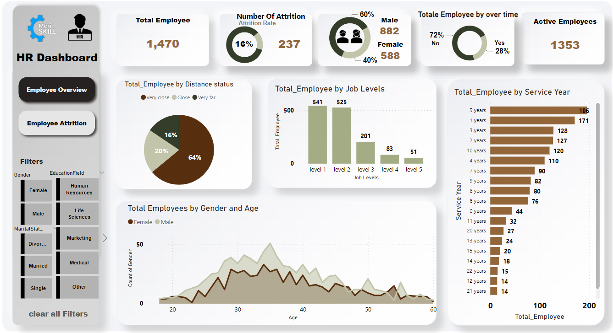
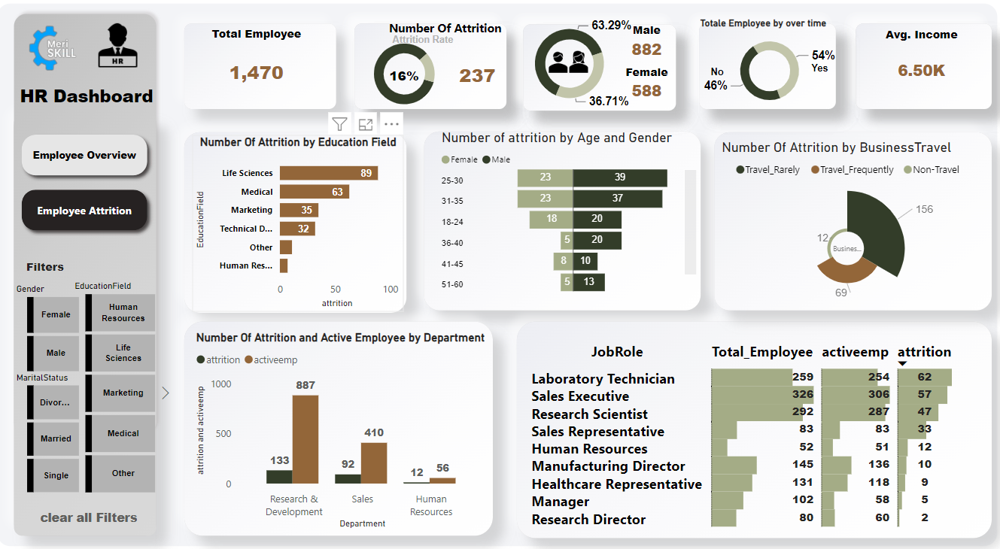

-----------------------------------------------------------------------------------
## Data Visualization using Power BI:
#### Employee overview Dashboard : 

#### Employee Attrition Dashboard : 

----------------------------------------------------------------------------------

As a Power BI Data Analyst, I executed comprehensive data cleaning using Power Query, enhancing dataset quality. I deleted redundant columns, renamed headers for clarity, and dropped duplicates. I meticulously cleaned individual columns and removed NaN values, ensuring a refined dataset.

Employing Power BI's visualization capabilities, I developed two impactful dashboards. The Employee Overview Dashboard provides a holistic view, revealing key metrics such as 1353 active employees, 64% living close to work, and a 16% attrition rate. The Employee Attrition Dashboard further delves into specifics, highlighting trends like 60% male to 40% female ratio, 28% overtime prevalence, and attrition patterns based on age, education field, and job roles.

Key insights include identifying attrition hotspots, such as job level 1 and Research & Development department, while also noting success areas like Sales Executive roles. Furthermore, the dashboard showcases demographic breakdowns and tenure distributions, offering a nuanced understanding of the workforce.

These visualizations not only facilitate quick comprehension but also empower stakeholders to make informed decisions, leveraging actionable insights derived from the data.
